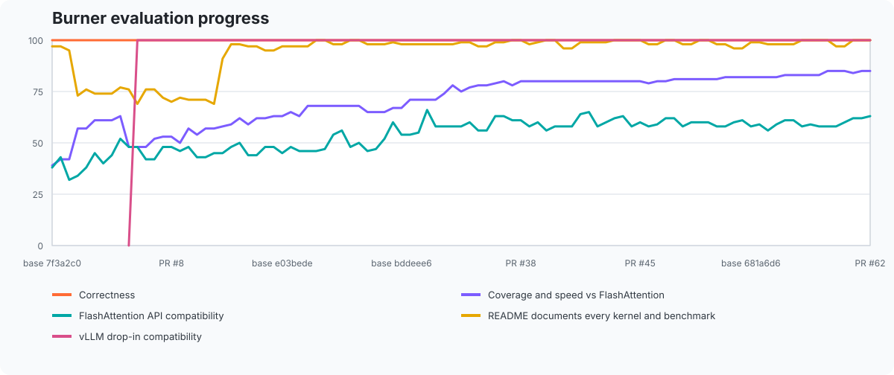

# helion-attention

A drop-in replacement for [FlashAttention](https://github.com/Dao-AILab/flash-attention)
whose kernels were generated by [Helion](https://github.com/pytorch/helion).

The kernels are checked in as **plain Triton**. Helion is a build-time tool here,
not a dependency: installing `helion-attention` pulls in `torch` and `triton` and
nothing else, and `import helion_attention` never imports Helion.

The one API difference from FlashAttention is that **`shape` is a required
argument**. Helion only beats FlashAttention when a kernel is specialized to one
exact problem size — block sizes, warp counts, pipelining stages, indexing mode
and the tensor strides are all baked into the generated Triton. Shapes in the
checked-in catalogue use those autotuned kernels. Other compatible dense calls
use a generic packed Triton kernel for correctness and API coverage. Declaring
the shape at the call site validates both paths and keeps acceleration explicit.

One measured Hopper encoder profile invokes PyTorch's Flash SDPA operator
directly: the exact noncausal bf16 `(2, 1024, 1024, 16, 16, 256)` MHA call.
Five more Hopper profiles invoke PyTorch's cuDNN SDPA operator directly: the
exact causal bf16 `(1, 4096, 4096, 32, 8, 128)` GQA,
`(1, 8192, 8192, 28, 4, 128)` GQA,
`(2, 8192, 8192, 16, 16, 128)` MHA,
`(4, 2048, 2048, 28, 4, 128)` GQA, and
`(4, 4096, 4096, 32, 32, 128)` MHA calls route there on SM90 when no backward
is needed, `softmax_scale` is left at its default, and all other options retain
their defaults. If PyTorch reports the selected backend unavailable for the
current configuration, the call falls back to its checked-in kernel. Explicit
scales, autograd, non-SM90 devices, and every other call retain their normal
generated-kernel or fallback dispatch.

## Install

```bash
pip install git+https://github.com/bobrenjc93/helion-attention
```

Requires a CUDA GPU. The checked-in kernels were autotuned on an NVIDIA H100
(compute capability 9.0); they are correct anywhere Triton runs, but the tuning
is Hopper-specific.

## Usage

```python
import torch
import helion_attention

B, S, H, D = 2, 1024, 32, 64
q, k, v = [torch.randn(B, S, H, D, device="cuda", dtype=torch.bfloat16) for _ in range(3)]

out = helion_attention.flash_attn_func(q, k, v, causal=True, shape=(B, S, H, D))
```

Everything else matches `flash_attn.flash_attn_func`: the layout is
`[batch, seqlen, nheads, head_dim]`, `softmax_scale` defaults to
`1/sqrt(head_dim)`, and `causal=True` uses FlashAttention's bottom-right causal
mask alignment.

One dense local-window profile is exposed through `flash_attn_func` and
`flash_attn_kvpacked_func`: causal bf16 Llama GQA with exact shape
`(1, 2048, 2048, 32, 8, 128)` accepts `window_size=(511, 0)`. Each query sees
itself and up to 511 preceding keys, for a 512-key window. Calls that do not
need backward use the generic packed Triton runtime; grad-enabled calls use a
bounded PyTorch SDPA autograd bridge for Q/K/V gradients. Both the default and
a custom `softmax_scale` are supported. `window_size=(-1, -1)` retains the
checked-in generated specialization when no backward is needed. Other windows
and shapes, dropout, softcap, ALiBi, `deterministic=True`, and diagnostic
returns remain unsupported for this local window.

Score capping is limited to the forward-only inference profiles described
below. The dense causal-bf16 Gemma-2 profile
`(1, 4096, 4096, 16, 8, 256)` accepts exactly `softcap=50.0` through
`flash_attn_func` and `flash_attn_kvpacked_func`, with either the default or a
custom `softmax_scale`. It uses the generic packed Triton runtime and applies
`50 * tanh(scores / 50)` before softmax. These calls also accept
`return_attn_probs=True` and return `(out, softmax_lse, S_dmask)`, with fp32
LSE shaped `[1, 16, 4096]` and an empty bf16 `S_dmask`, through both entry
points. `softcap=0` retains the usual generic dispatch for this unregistered
shape. Other caps and profiles remain unsupported; softcap cannot be combined
with dropout, ALiBi, local windows, or autograd, and its diagnostic return
requires `deterministic=False`.

The checked-in noncausal bf16 BERT-base encoder profile
`(16, 512, 512, 12, 12, 64)` supports `return_attn_probs=True` through the
dense, QKV-packed, and KV-packed entry points. A forward-only, dropout-free
call returns `(out, softmax_lse, S_dmask)` with fp32 LSE shaped
`[16, 12, 512]` and an empty bf16 `S_dmask`, matching FA2. Diagnostic calls
use the generic packed runtime; ordinary calls retain the generated
specialization. The same three entry points accept `0 < dropout_p < 1` through
PyTorch SDPA, with either the default or a custom `softmax_scale`. Causal mode,
ALiBi, deterministic dropout, dropout diagnostics, and other dense profiles
remain outside this BERT-base subset. For zero-dropout training, the same
entry points accept `deterministic=True` with either scale and call PyTorch's
repeatable math operator directly, without changing global SDPA backend flags.

The checked-in causal bf16 GPT-2 profile
`(2, 1024, 1024, 32, 32, 64)` likewise supports `return_attn_probs=True`
through the dense, QKV-packed, and KV-packed entry points. A zero-dropout call
returns `(out, softmax_lse, S_dmask)` with fp32 LSE shaped `[2, 32, 1024]` and
an empty bf16 `S_dmask`, matching FA2. Grad-enabled calls use PyTorch SDPA for
the output and Q/K/V gradients while retaining the generic packed runtime's LSE;
as in FA2, LSE and `S_dmask` gradients contribute zero. The default and custom
`softmax_scale` are supported. No-backward diagnostic dispatch remains wholly
on the generic packed runtime, while output-only calls retain the generated
specialization. Positive dropout, noncausal mode, deterministic mode, ALiBi,
local windows, softcap, other dtypes, and other profiles remain outside this
diagnostic subset.

The three checked-in batch-1 Llama GQA decode profiles (one query token and a
1K, 4K, or 16K KV sequence) support `return_attn_probs=True` through both
`flash_attn_func` and `flash_attn_kvpacked_func`. For calls that do not require
backward and otherwise use the default options, this returns `(out,
softmax_lse, S_dmask)`. The LSE is fp32 with shape `[batch, heads_q, 1]`;
because dropout is zero, `S_dmask` is an empty tensor with the input dtype,
matching FA2. A custom `softmax_scale` is supported, and either causal flag may
be used because they are equivalent for bottom-right single-token decode.

Dense calls do not need a checked-in specialization. Contiguous CUDA fp16 and
bf16 MHA/GQA inputs with `head_dim <= 256` use the generic Triton forward when
their exact shape is absent, including unequal query/key lengths and
bottom-right causal masking. Grad-enabled calls without a generated backward
use PyTorch SDPA autograd instead; the exact BERT-base profile above and causal
GPT-2 profile below use its direct math operator when deterministic backward is
requested. Dense ALiBi forward calls accept fp32 slopes shaped `[nheads]` or
`[batch, nheads]` and always use the generic Triton path; ALiBi backward is not
implemented. The shipped noncausal bf16
`(8, 512, 512, 16, 16, 64)` encoder-training profile retains generated forward
values during zero-dropout training. On SM90, calls that omit `softmax_scale`
use raw PyTorch BSHD Flash gradients, falling back to the generated backward
when Flash is unavailable. Explicit-scale, non-SM90, and deterministic calls
retain the generated backward. This profile, the BERT-base profile above, and
the shipped causal bf16 `(2, 1024, 1024, 32, 32, 64)` GPT-2 profile accept
`0 < dropout_p < 1` through SDPA in the dense, QKV-packed, and KV-packed APIs,
with either the default or a custom scale. Zero-dropout calls that do not need
backward retain each generated specialization. Zero-dropout GPT-2 training also
accepts `deterministic=True` with either scale through the direct math operator
used by BERT-base. Other dropout calls, other local windows, softcap outside the
exact dense, varlen, and paged subsets described here, dense diagnostic returns
outside the subsets above, and deterministic dropout still fail explicitly as
described below.
Unregistered calls must also fit the generic kernel's signed 32-bit Q/output
and K/V element offsets.

Packed variable-length batches use FlashAttention's THD layout and cumulative
sequence lengths. The sequence dimensions in `shape` are the declared maxima;
the packed totals and individual lengths can change on every call:

```python
B, MAX_S, H, D = 8, 512, 16, 64
lengths = torch.tensor([512, 450, 384, 300, 256, 128, 64, 17], device="cuda")
cu_seqlens = torch.nn.functional.pad(lengths.cumsum(0), (1, 0)).to(torch.int32)
total = int(lengths.sum())
q, k, v = [
    torch.randn(total, H, D, device="cuda", dtype=torch.bfloat16)
    for _ in range(3)
]

out = helion_attention.flash_attn_varlen_func(
    q,
    k,
    v,
    cu_seqlens,
    cu_seqlens,
    MAX_S,
    MAX_S,
    causal=True,
    shape=(B, MAX_S, H, D),
)
```

`cu_seqlens_q` and `cu_seqlens_k` remain on the GPU and may describe different
query and key lengths. Causal masking follows FlashAttention's bottom-right
alignment, including zero output for fully masked query rows.

One deliberately unregistered varlen profile is also callable through the
generic packed Triton runtime: causal bf16 Llama-3 GQA with maximum shape
`(4, 256, 256, 32, 8, 128)`. It supports only calls that do not require
backward. Device-side `cu_seqlens_q` and `cu_seqlens_k` may independently
describe ragged query and key lengths with different packed token totals;
shared-offset self-attention continues to support mixed empty and nonempty
slots. The unpacked and KV-packed entry points accept the default or a custom
`softmax_scale`. Calls also accept `return_attn_probs=True` and return
`(out, softmax_lse, S_dmask)`, with fp32 LSE shaped `[32, total_q]` and an empty
bf16 `S_dmask`, for ragged self-attention and cross-attention with nonempty key
sequences. The KV-packed adapter inherits this support. Forward-only fp32 ALiBi
slopes shaped `[32]` or `[4, 32]` may be supplied with or without the diagnostic
return; ordinary and ALiBi-only calls retain their existing generic dispatch.
Dropout, windows, softcap, deterministic mode, paged caches, and backward remain
unsupported. Because this is generic fallback coverage rather than a generated
specialization, `is_varlen_shape_supported` remains false for the profile.

The noncausal bf16 `(8, 512, 512, 16, 16, 64)` varlen profile accepts finite
symmetric windows as `window_size=(radius, radius)`, where `radius >= 0`, for
self-attention. Dynamic ragged lengths with identical query/key cumulative
offsets are supported for forward-only calls through the generic packed Triton
runtime. Zero-dropout backward is supported only when all eight sequences have
length 512, through a dense windowed PyTorch SDPA call. Both paths accept the
default or a custom `softmax_scale`, and the varlen QKV-packed adapter inherits
the support. The global `(-1, -1)` default retains its existing dispatch.
Asymmetric windows, cross-attention offsets, other profiles, ragged backward,
paged caches, ALiBi, diagnostic returns, softcap, dropout, and deterministic
mode remain unsupported in combination with a varlen window.

The causal bf16 `(8, 512, 512, 16, 16, 64)` varlen profile accepts exactly
`window_size=(127, 0)` when all eight query and key sequences have length 512.
Calls that do not require backward use the generic packed Triton runtime for
this 128-key window (the current token plus up to 127 tokens to its left).
Zero-dropout backward reshapes the packed inputs to one dense batch and uses a
bounded causal-window PyTorch SDPA call. Both paths accept the default or a
custom `softmax_scale`. The unpacked and QKV/KV-packed varlen entry points all
inherit this support, and their grad-enabled paths provide Q/K/V gradients.
The global `(-1, -1)` call retains generated dispatch when no backward is
needed and its existing unwindowed SDPA bridge for backward. Ragged or
noncanonical offsets, other windows or profiles, diagnostics, ALiBi, softcap,
dropout, paged caches, deterministic mode, and CUDA graph capture remain
unsupported for this causal window.

This shipped causal bf16 `(8, 512, 512, 16, 16, 64)` varlen profile accepts
exactly `softcap=50.0` for calls that do not require backward. Dynamic ragged
query/key lengths and the default or a custom `softmax_scale` are supported by
the unpacked and QKV/KV-packed entry points. Softcapped calls use the generic
packed Triton runtime and apply `50 * tanh(scores / 50)` before softmax;
`softcap=0` retains the generated specialization. Other caps and profiles,
gradients, dropout, ALiBi, local windows, and diagnostic returns remain
unsupported with softcap. Paged softcap remains unsupported except for the
exact core page-size-256/page-size-512 decode profile described below.

The causal bf16 `(8, 512, 512, 16, 16, 64)` varlen profile supports
`return_attn_probs=True` with otherwise default options apart from `causal=True`,
an optional custom `softmax_scale`, and optional fp32 ALiBi slopes shaped `[16]`
or `[8, 16]`. Forward calls may be ragged; slope-free backward is restricted to
all eight query and key sequences having length 512. It returns
`(out, softmax_lse, S_dmask)`, where LSE is fp32 with shape `[16, total_q]` and
`S_dmask` is an empty bf16 tensor. Only `out` contributes Q/K/V gradients; LSE
and `S_dmask` gradients are ignored, matching FA2. Fully masked causal rows in
ragged forward calls have zero output and `+inf` LSE. The generated
specialization remains the path when the option is false and no ALiBi slopes
are supplied; diagnostic calls use the generic packed runtime that produces
LSE directly. The varlen QKV/KV-packed adapters inherit this support. Combined
ALiBi diagnostic calls remain forward-only and reject paging, deterministic
mode, and other optional features.

Both the causal and noncausal bf16 profiles at these maxima support forward-only
ALiBi. Pass fp32 CUDA slopes shaped `[16]` or `[8, 16]` through `alibi_slopes`;
both the unpacked API and the varlen QKV/KV-packed adapters accept them, with
either the default or a custom `softmax_scale`. On the causal profile these
slopes may be combined with `return_attn_probs=True`. The causal bf16 Llama-3
profile above likewise accepts `[32]` or `[4, 32]` slopes, including with its
diagnostic return, through its unpacked and KV-packed entry points. ALiBi-only
calls use the generic packed Triton runtime, while `alibi_slopes=None` retains
each profile's existing dispatch. Other non-paged varlen profiles still reject
ALiBi explicitly. The one direct core paged-varlen profile with ALiBi is
forward-only bf16 page-size-256 or page-size-512 decode
`(4, 1, 1024, 8, 2, 128)`, which accepts fp32 CUDA slopes shaped `[8]` or
`[4, 8]`; page-size-16 calls, chunked prefill, and other paged profiles still
reject them. The KV-cache paths described below have their own paged ALiBi
support.

Zero-dropout backward is supported for both the causal and noncausal bf16
`(8, 512, 512, 16, 16, 64)` varlen profiles when all eight query and key
sequences have length 512 (so their valid cumulative offsets are
`[0, 512, ..., 4096]`). The causal profile additionally supports independent
query and key cumulative offsets describing eight nonempty key sequences and a
mix of empty and nonempty query slots, with at least one nonempty query and all
lengths at most 512. Causal self-attention also accepts identical query and key
offsets containing both empty and nonempty slots. Full-length inputs are viewed
as one dense batch; ragged causal inputs use one bounded PyTorch SDPA call per
nonempty query sequence. Both paths provide forward and Q/K/V gradients for the
default or a custom `softmax_scale`. The QKV-packed adapter inherits
self-attention support; the KV-packed adapter accepts the same independent
query/key cases, including zero-length query slots paired with nonempty key
slots. Full-length causal training additionally accepts the diagnostic return
described above when `deterministic=False`. Training without diagnostics remains
CUDA-graph capturable. Both full-length profiles also accept
`deterministic=True` with either scale when diagnostics and local windows are
disabled, routing the reshaped batch through direct math SDPA for
bitwise-repeatable outputs and Q/K/V gradients; both packed adapters inherit
these paths.
Ragged training reads the cumulative offsets on the host for validation and
therefore rejects graph capture. Calls that do not require gradients continue
to use the generated varlen kernel, including ragged and full-length calls.
Ragged noncausal batches, batches with no nonempty queries, cross-attention
batches with any empty key slot, deterministic mode outside these exact
full-length profiles, paged caches, ALiBi, ragged diagnostic returns, and
positive dropout remain explicitly unsupported for varlen backward.

The core `flash_attn_varlen_func` exposes exactly two forward-only paged
profiles when `block_table` is supplied. Both accept bf16 page-size-16 caches;
the single-token decode profile additionally accepts page-size-256 and
page-size-512 caches. Caches use
`[num_blocks, page_size, heads_kv, head_dim]` layout. All supported paths handle
ragged request lengths and permuted physical pages and accept the default or a
custom `softmax_scale`:

| profile | page sizes | causal modes | dispatch | use |
| --- | --- | --- | --- | --- |
| `(2, 200, 320, 8, 2, 128)` | 16 | `True` | generated | chunked prefill |
| `(4, 1, 1024, 8, 2, 128)` | 16, 256, 512 | `True` or `False` | generated for 16; generic paged runtime for 256/512 | single-token decode |

As on the non-paged path, the shape sequence dimensions are maxima and actual
lengths come from adjacent cumulative offsets. The chunked-prefill profile
uses bottom-right causal alignment. The decode modes are equivalent because a
bottom-right single-token query can see the whole used cache. Page-size-256 and
page-size-512 decode support the default option set plus either causal flag and
a default or custom `softmax_scale`. Both additionally accept optional
forward-only fp32 ALiBi slopes shaped `[8]` or `[4, 8]` or exactly
`softcap=50.0`. ALiBi and softcap use the generic paged runtime
and support the same ragged, permuted logical caches, but cannot be combined.
`softcap=0` preserves the existing slope-free dispatch. Gradients, dropout,
sliding windows, `deterministic=True`, diagnostic returns, other caps and
softcap page sizes, and combinations of ALiBi or softcap with those features
remain unsupported. Other page sizes and paged core-varlen profiles are
rejected explicitly.

vLLM's unified paged-cache path is available through
`helion_attention.vllm_flash_attn`. It accepts packed queries plus
`k`/`v` caches in `[num_blocks, page_size, heads_kv, head_dim]` layout,
`block_table`, and per-request `seqused_k`. Generated page-size-16 kernels cover
the common decode and chunked-prefill profiles below; other compatible CUDA
shapes retain the generic single-launch path.

Single-token decode reads a KV cache through the matching FlashAttention entry
point. The six-field shape remains required and describes the query and the
cache separately. The general path uses a dense cache:

```python
B, S_CACHE, H_Q, H_KV, D = 1, 4096, 32, 8, 128
q = torch.randn(B, 1, H_Q, D, device="cuda", dtype=torch.bfloat16)
k_cache = torch.randn(B, S_CACHE, H_KV, D, device="cuda", dtype=torch.bfloat16)
v_cache = torch.randn_like(k_cache)

out = helion_attention.flash_attn_with_kvcache(
    q,
    k_cache,
    v_cache,
    causal=True,
    shape=(B, 1, S_CACHE, H_Q, H_KV, D),
)
```

The exact bf16 4K profile above also accepts forward-only fp32 ALiBi slopes
shaped `[32]` or `[1, 32]` for a full-cache read or a Python-integer prefix from
1 through 4095, with either decode-equivalent causal flag and the default or a
custom `softmax_scale`. With `causal=True`, the same slopes may be paired with
a contiguous CUDA int32 `cache_seqlens` tensor shaped `[1]` selecting a prefix
from 1 through 4096, provided `cache_leftpad` is omitted:

```python
slopes = torch.linspace(0.01, 0.2, H_Q, device="cuda", dtype=torch.float32)
prefix_length = torch.tensor([1025], device="cuda", dtype=torch.int32)
out = helion_attention.flash_attn_with_kvcache(
    q,
    k_cache,
    v_cache,
    cache_seqlens=prefix_length,
    causal=True,
    alibi_slopes=slopes,
    shape=(B, 1, S_CACHE, H_Q, H_KV, D),
)
```

ALiBi uses the generic packed Triton runtime and never mutates the cache;
slope-free full-cache global-window calls retain the checked-in generated
specialization, and slope-free prefixes retain their existing packed-prefix
dispatch. Full-cache ALiBi retains its existing generic dense dispatch. This
narrow mode does not support LSE, updates, cache remapping, left padding,
rotary, windows, softcap, or autograd. Tensor-selected ALiBi remains limited to
the causal 4K prefix above; noncausal and other tensor-span profiles remain
slope-free.

The exact causal bf16 `(1, 1, 1024, 32, 8, 128)` profile accepts a read-only
Python integer `cache_seqlens` from 1 through 1024. It also accepts a contiguous
CUDA int32 tensor shaped `[1]`; an optional matching `cache_leftpad` selects
`[cache_leftpad, cache_seqlens)`, with
`0 <= cache_leftpad < cache_seqlens <= 1024`. Both forms support the default or
a custom `softmax_scale` and optional fp32 LSE, use the generic packed Triton
runtime for partial or tensor-selected spans, and never mutate the cache.
Omitting the length or passing 1024 as a Python integer retains the checked-in
generated dispatch, as does the existing final-slot append at position 1023.
Tensor spans reject updates, cache remapping, rotary, ALiBi, windows, softcap,
explicit split counts, autograd, and CUDA graph capture. Noncausal tensor spans
and tensor spans on other 1K profiles remain unsupported.

The same exact bf16 4K profile accepts a Python integer `cache_seqlens` from 1
through 4095 for read-only prefix attention, optionally with ALiBi as described
above. It also accepts slope-free paired one-token K/V updates at Python-integer
positions 0 through 4094, mutates that slot, and attends through the appended
token. Both causal flags and the default or a custom `softmax_scale` are
supported. Slope-free calls additionally support optional fp32 LSE, and updates
optionally apply full-head interleaved or GPT-NeoX rotary, or D64 half-head
interleaved rotary. These calls use the generic packed Triton runtime. With the
global `window_size=(-1, -1)`,
omitting the length or passing 4096 for a slope-free read retains the checked-in
generated dispatch, as does the existing final-slot append at position 4095.

A forward-only, slope-free full-cache read on this exact 4K profile also accepts
`window_size=(511, 0)` with either causal flag and the default or a custom
`softmax_scale`. It attends only to cache rows 3584 through 4095, exposes only
that 512-row tail to the generic packed Triton kernel, and never mutates cache
storage. `cache_seqlens` must be omitted or supplied as the Python integer 4096.
Partial or tensor-valued lengths, LSE, updates, ALiBi, cache remapping, left
padding, rotary, softcap, explicit split counts, autograd, other windows, and
other profiles remain unsupported for this local-window path.

The 4K profile also accepts a contiguous CUDA int32 `cache_seqlens` tensor
shaped `[1]` for a read-only prefix. Slope-free tensor spans support both causal
flags, either scale, optional fp32 LSE, and an optional contiguous CUDA int32
`cache_leftpad` tensor shaped `[1]` selecting the half-open span
`[cache_leftpad, cache_seqlens)`, with
`0 <= cache_leftpad < cache_seqlens <= 4096`. The causal profile additionally
accepts ALiBi slopes shaped `[32]` or `[1, 32]` for a tensor-selected prefix
when `cache_leftpad` is omitted; this combination supports either scale but not
LSE. All tensor-span forms never mutate the cache and synchronize once for
recoverable bounds validation. Updates, cache remapping, rotary, windows,
softcap, explicit split counts, autograd, and CUDA graph capture remain
unsupported. Tensor-selected ALiBi with left padding, noncausal attention, or
other dense profiles also remains unsupported. Scalar prefixes and tensor
spans on other dense profiles, plus non-final appends outside this 4K profile,
remain unsupported except for the separately documented two-token 1K update
and 1K and 16K read slices.

Two strict speculative-decoding slices use the generic packed Triton runtime
with a dense cache. Causal bf16 `(1, 2, 1024, 32, 8, 128)` accepts either the
default or a custom `softmax_scale`; its read-only form requires the full cache.
It also accepts a paired two-token K/V update at Python-integer
`cache_seqlens` positions 0 through 1022. Positions 0 through 1021 mutate the
selected slots and attend through the appended prefix with the generic packed
runtime. The final update at position 1022 retains full-cache dispatch and
optionally applies full-head interleaved rotary to Q and the appended K at
positions 1022 and 1023. Non-final updates reject rotary before mutation.
Causal bf16 `(1, 4, 1024, 32, 8, 128)` is strictly read-only and accepts an
omitted length or a Python integer `cache_seqlens` from 4 through 1024 with
either scale and optionally returns fp32 LSE shaped `[1, 32, 4]`. Partial
prefixes use the generic packed runtime; omitted and full-length calls retain
their existing dispatch. The four-token path never mutates cache storage. It
does not support updates, tensor-valued lengths, rotary, cache remapping,
optional attention features, autograd, or noncausal mode; other query lengths
remain unsupported.

For supported slope-free single-token dense caches and the exact four-token
profile above, pass
`return_softmax_lse=True` to receive `(out, softmax_lse)`. The LSE is fp32 with
shape `[batch, heads_q, query_len]`, matching FlashAttention's KV-cache API.
The exact paged decode profile below supports the same return for both the
default and a custom `softmax_scale`.

The causal bf16 dense profile `(1, 1, 16384, 32, 8, 128)` accepts the same
contiguous CUDA int32 span tensors. Values from 1 through 16384 select a prefix,
and `cache_leftpad` changes it to `[cache_leftpad, cache_seqlens)`, with
`0 <= cache_leftpad < cache_seqlens <= 16384`. Both forms support the default or
a custom `softmax_scale` and optional fp32 LSE. This path synchronizes once to
check bounds recoverably, so it rejects CUDA graph capture and autograd.
`cache_leftpad` is not supported with updates, cache remapping, rotary, paged
caches, or profiles outside the exact causal 1K, either-causal 4K, and causal
16K slices. Omitting the length or passing the full length as a Python integer
retains the checked-in split-KV generated kernel. Those full, read-only calls
also accept `num_splits=16`, matching the generated kernel's fixed split count.
Other explicit split counts, profiles, tensor spans, updates, rotary calls, and
autograd are rejected before dispatch.

Two exact bf16 profiles also accept a paged cache through
`flash_attn_with_kvcache`: read-only page-size-16 chunked prefill
`(2, 200, 320, 8, 2, 128)` with `causal=True`, and decode
`(4, 1, 1024, 8, 2, 128)` with page size 16, 256, or 512 and either causal
mode.
`cache_seqlens` must be a CUDA int32 tensor shaped `[batch]`; each row may
select a different used length. Logical pages can map to physical cache pages
in any order. Queries use dense BSHD layout and results are returned in that
same layout. Chunked prefill uses bottom-right causal alignment. For decode,
the default `causal=False` is equivalent to `causal=True`. The page-size-16
profiles and page-size-256/page-size-512 decode also accept forward-only fp32
ALiBi slopes shaped `[8]` or `[batch, 8]` (`[2, 8]` for chunked prefill and
`[4, 8]` for decode). Page-size-512 decode supports the default or a custom
scale and an optional fp32 LSE return, plus either exactly `softcap=50.0` or
ALiBi. For example, page-size-512 ALiBi is called as follows:

```python
B, MAX_CACHE, H_Q, H_KV, D, PAGE_SIZE = 4, 1024, 8, 2, 128, 512
NUM_BLOCKS = B * (MAX_CACHE // PAGE_SIZE)
q = torch.randn(B, 1, H_Q, D, device="cuda", dtype=torch.bfloat16)
k_cache = torch.randn(NUM_BLOCKS, PAGE_SIZE, H_KV, D, device="cuda", dtype=torch.bfloat16)
v_cache = torch.randn_like(k_cache)
cache_seqlens = torch.tensor([37, 128, 1024, 5], device="cuda", dtype=torch.int32)
alibi_slopes = torch.linspace(0.01, 0.2, H_Q, device="cuda", dtype=torch.float32)
block_table = torch.randperm(
    NUM_BLOCKS, device="cuda", dtype=torch.int32
).view(B, MAX_CACHE // PAGE_SIZE)

out = helion_attention.flash_attn_with_kvcache(
    q,
    k_cache,
    v_cache,
    cache_seqlens=cache_seqlens,
    block_table=block_table,
    softmax_scale=0.37,
    alibi_slopes=alibi_slopes,
    shape=(B, 1, MAX_CACHE, H_Q, H_KV, D),
)
```

The page-size-16 decode profile additionally accepts paired, contiguous
one-token `k`/`v` updates shaped `[4, 1, 2, 128]` when all four
`cache_seqlens` values equal 1023. Its full logical block table must map to
in-range, disjoint physical pages; pages may be arbitrarily permuted. The
adapter writes the updates to logical position 1023, leaves `cache_seqlens`
unchanged, and attends through all 1024 tokens with the same generated page-16
reader. Either causal flag and the default or a custom `softmax_scale` are
supported. LSE, rotary, ALiBi, windows, softcap, autograd, CUDA graph capture,
other lengths, other page sizes, overlapping caches/query storage, and aliased
logical pages reject before either cache is changed. Update-source aliases are
staged before the paired writes. Chunked prefill and all other paged modes
remain read-only.

Slope-free output-only page-size-16 calls route through their checked-in
paged-varlen kernels. Page-size-256 and page-size-512 decode calls and all paged
ALiBi calls use the generic single-launch paged runtime, as do slope-free LSE
requests and the page-size-256/page-size-512 decode combination of ALiBi with
LSE. These return fp32 `[4, 8, 1]` LSE alongside the `[4, 1, 8, 128]` output.
For ALiBi,
causal decode follows FA2's position-shifted diagnostic convention: each
single-query LSE is the mathematical value plus
`slope * (cache_seqlen - 1)`; noncausal decode is unshifted. None of these
read-only calls mutates the cache. Read-only page-size-256 and page-size-512
decode additionally accept exactly `softcap=50.0`, with the default or a
custom scale and with or without the LSE return. `softcap=0` preserves the
existing dispatch, including the generated path for page-size-16 output-only
calls. Other caps, page sizes, and profiles, ALiBi with softcap, ALiBi with LSE
outside the exact read-only page-size-256/page-size-512 decode profile, paged
updates outside the exact final-slot slice above, rotary, windows, and autograd
are rejected before dispatch. LSE on chunked
prefill, non-causal chunked prefill, every other paged profile, and every page
size other than 16, 256, or 512 are also rejected before dispatch.

The single-token dense decode paths append one paired K/V token when a scalar
cache length points at the final slot declared by `shape`:

```python
new_k = torch.randn(B, 1, H_KV, D, device="cuda", dtype=torch.bfloat16)
new_v = torch.randn_like(new_k)
out = helion_attention.flash_attn_with_kvcache(
    q,
    k_cache,
    v_cache,
    k=new_k,
    v=new_v,
    cache_seqlens=S_CACHE - 1,
    causal=True,
    shape=(B, 1, S_CACHE, H_Q, H_KV, D),
)
```

The append mutates both dense caches in place and attends over the updated full
cache. The exact bf16 4K profile additionally permits positions 0 through 4094
and attends over the updated prefix ending at that position. Those non-final
appends optionally apply full-head interleaved or GPT-NeoX rotary, or D64
half-head interleaved rotary, to Q and the appended K at that position and use
the generic packed runtime; the final-slot append continues to use the
generated specialization. The exact
two-token profile
above similarly accepts paired K/V tensors shaped `[1, 2, 8, 128]` at Python
integer `cache_seqlens` positions 0 through 1022 and mutates only those two
slots. Non-final positions attend through the appended prefix; position 1022
retains the existing full-cache dispatch.
Dense read-only calls may omit `cache_seqlens` or pass the full cache length,
including the exact four-token profile above; the exact causal single-token and
four-token 1K and either-causal 4K profiles additionally accept their documented
scalar prefixes, the 4K profile accepts tensor-selected spans with either
causal flag, and the exact causal 16K profile accepts its tensor prefix or
left-padded span.
Single-token update lengths must satisfy `cache_seqlens + 1 == S_CACHE`, except
for the exact 4K non-final appends above; the exact two-token update accepts
`0 <= cache_seqlens <= 1022`. Other multi-token updates, scalar partial lengths
outside the exact causal single-token and four-token 1K and either-causal 4K
read-only profiles, non-final appends outside the exact 4K one-token and 1K
two-token profiles, and tensor lengths on every other dense profile are
rejected explicitly. Caches created
inside `torch.inference_mode()` must be updated while that mode remains
enabled. For an append, `q`, `k_cache`, and `v_cache` must occupy disjoint
memory; update `k`/`v` aliases are staged safely.

The one-token final-slot append accepts paired, contiguous `rotary_cos` and
`rotary_sin` tensors shaped `[seqlen_ro, rotary_dim / 2]`, with
`seqlen_ro >= S_CACHE` and the same CUDA dtype/device as `q`. The default
interleaved layout rotates adjacent pairs in `q` and `new_k` at position
`cache_seqlens`; the rotated key is what the cache stores. `rotary_dim` may be
the full head dimension, or 64 for a D128 head; the latter preserves dimensions
64 through 127 unchanged. Passing `rotary_interleaved=False` selects the GPT-NeoX
split-half pair layout and is supported only for full-head rotation. Other
partial rotary dimensions and rotary on a read-only call are rejected. The
exact 4K non-final append accepts full-head rotation in either layout and D64
half-head rotation in the interleaved layout. The exact two-token final append
remains full-head interleaved-only and uses consecutive positions 1022 and 1023
for its Q/K tokens; earlier two-token appends do not support rotary.

`shape` accepts:

| form | meaning |
| --- | --- |
| `(batch, seqlen, nheads, head_dim)` | self-attention, MHA |
| `(batch, seqlen_q, seqlen_k, nheads_q, nheads_kv, head_dim)` | cross-attention and/or GQA |
| `helion_attention.AttnShape(...)` | the same fields, spelled out |

The declared shape is checked against the tensors, so a mismatch is a `ValueError`
rather than a wrong answer.

Ask whether a call has a checked-in accelerated specialization:

```python
helion_attention.is_shape_supported((2, 1024, 32, 64), torch.bfloat16, causal=True)
helion_attention.available_shapes()   # every shape this build ships
helion_attention.is_varlen_shape_supported((8, 512, 16, 64), causal=True)
helion_attention.available_varlen_shapes()
helion_attention.is_paged_shape_supported(
    (4, 1, 1024, 8, 2, 128), causal=True, page_size=16
)
helion_attention.available_paged_shapes()
```

These introspection functions intentionally describe only checked-in generated
kernels; they do not report generic fallback coverage. An unlisted compatible
dense shape remains callable but is not specialization-accelerated. Dense shapes
outside the fallback envelope and all other unlisted varlen/paged shapes raise
`UnsupportedShapeError`. **To accelerate an unlisted shape, please
[file an issue](https://github.com/bobrenjc93/helion-attention/issues)** — adding
a specialization is an autotuning run, not a runtime code change.

## Checked-in accelerated shapes

<!-- SHAPES:START -->
| batch | seqlen q | seqlen k | heads q | heads kv | head dim | dtype | causal | note |
| ---: | ---: | ---: | ---: | ---: | ---: | --- | --- | --- |
| 16 | 512 | 512 | 12 | 12 | 64 | bf16 | no | BERT-base encoder |
| 1 | 16384 | 16384 | 16 | 16 | 128 | bf16 | yes | 16k context, single sequence |
| 1 | 1 | 1024 | 32 | 8 | 128 | bf16 | yes | Llama-3-8B single-token decode, 1k KV cache |
| 1 | 1 | 16384 | 32 | 8 | 128 | bf16 | yes | Llama-3-8B single-token decode, 16k KV cache |
| 1 | 1 | 4096 | 32 | 8 | 128 | bf16 | yes | Llama-3-8B single-token decode, 4k KV cache |
| 1 | 2048 | 2048 | 28 | 4 | 128 | bf16 | yes | Qwen2-7B GQA 7:1 |
| 1 | 2048 | 2048 | 32 | 32 | 128 | bf16 | yes | single-sequence 7B prefill |
| 1 | 2048 | 2048 | 32 | 8 | 128 | bf16 | yes | Llama-3-8B GQA 4:1 |
| 1 | 4096 | 4096 | 28 | 4 | 128 | bf16 | yes | Qwen2-7B GQA 7:1 |
| 1 | 4096 | 4096 | 32 | 8 | 128 | bf16 | yes | Llama-3-8B GQA 4:1 |
| 1 | 64 | 320 | 8 | 2 | 128 | bf16 | yes | vLLM chunked-prefill causal alignment |
| 1 | 64 | 64 | 32 | 8 | 128 | bf16 | yes | Llama-3-8B 64-token GQA prefill |
| 1 | 8192 | 8192 | 28 | 4 | 128 | bf16 | yes | Qwen2-7B GQA 7:1 |
| 1 | 8192 | 8192 | 32 | 8 | 128 | bf16 | yes | Llama-3-8B GQA 4:1 |
| 2 | 1024 | 1024 | 16 | 16 | 256 | bf16 | no | vision/multimodal encoder |
| 2 | 1024 | 1024 | 32 | 32 | 64 | bf16 | yes | GPT-2 medium style, causal |
| 2 | 1024 | 1024 | 32 | 32 | 64 | bf16 | no | GPT-2 medium style prefill |
| 2 | 1024 | 1024 | 32 | 32 | 64 | fp16 | no | fp16 coverage |
| 2 | 8192 | 8192 | 16 | 16 | 128 | bf16 | yes | long-context causal |
| 4 | 2048 | 2048 | 28 | 4 | 128 | bf16 | yes | Qwen2-7B GQA 7:1 |
| 4 | 2048 | 2048 | 32 | 8 | 128 | bf16 | yes | Llama-3-8B GQA 4:1 |
| 4 | 4096 | 4096 | 28 | 4 | 128 | bf16 | yes | Qwen2-7B GQA 7:1 |
| 4 | 4096 | 4096 | 32 | 32 | 128 | bf16 | yes | 7B-class prefill, causal |
| 4 | 4096 | 4096 | 32 | 32 | 128 | bf16 | no | 7B-class prefill, bidirectional |
| 4 | 4096 | 4096 | 32 | 32 | 128 | fp16 | yes | fp16 causal coverage |
| 4 | 4096 | 4096 | 32 | 8 | 128 | bf16 | yes | Llama-3-8B GQA 4:1 |
| 4 | 8192 | 8192 | 28 | 4 | 128 | bf16 | yes | Qwen2-7B GQA 7:1 |
| 4 | 8192 | 8192 | 32 | 8 | 128 | bf16 | yes | Llama-3-8B GQA 4:1 |
| 8 | 1024 | 1024 | 8 | 8 | 32 | bf16 | yes | small-model decoder |
| 8 | 128 | 128 | 8 | 8 | 32 | bf16 | yes | small-model decoder |
| 8 | 16 | 16 | 8 | 8 | 32 | bf16 | yes | small-model decoder |
| 8 | 2048 | 2048 | 16 | 16 | 64 | bf16 | yes | small decoder, long batch |
| 8 | 256 | 256 | 8 | 8 | 32 | bf16 | yes | small-model decoder |
| 8 | 32 | 32 | 8 | 8 | 32 | bf16 | yes | small-model decoder |
| 8 | 512 | 512 | 16 | 16 | 64 | bf16 | no | short-sequence encoder batch |
| 8 | 512 | 512 | 8 | 8 | 32 | bf16 | yes | small-model decoder |
| 8 | 64 | 64 | 8 | 8 | 32 | bf16 | yes | small-model decoder |

37 kernels.
<!-- SHAPES:END -->

Packed varlen kernels specialize the batch size and maximum lengths while
accepting dynamic packed token totals:

| batch | max seqlen q | max seqlen k | heads | head dim | dtype | causal | note |
| ---: | ---: | ---: | ---: | ---: | --- | --- | --- |
| 8 | 512 | 512 | 16 | 64 | bf16 | yes | ragged decoder batch |
| 8 | 512 | 512 | 16 | 64 | bf16 | no | ragged encoder batch |

Paged KV kernels specialize the maximum request lengths and page size while
reading actual query/cache lengths and physical page assignments on-device:

| batch | max seqlen q | max seqlen k | heads q | heads kv | head dim | page size | dtype | causal | note |
| ---: | ---: | ---: | ---: | ---: | ---: | ---: | --- | --- | --- |
| 2 | 200 | 320 | 8 | 2 | 128 | 16 | bf16 | yes | vLLM paged chunked prefill |
| 4 | 1 | 1024 | 8 | 2 | 128 | 16 | bf16 | yes | vLLM paged ragged decode |

## Autotuning provenance

Every newly generated module records the exact Helion version and copyable
`helion.Config(...)` selected for it, along with the search wall time and the
winning measured kernel time. The same structured data is stored under
`autotuning_provenance` in `helion_attention/kernels/manifest.json`; construct
the recorded config programmatically with
`helion.Config(**provenance["configs"][0]["config"])`. A `fixed` row is a
deliberately hand-selected specialization and therefore has zero search time.
An `incumbent` row means a new search ran, but its winner failed the same-process
acceptance benchmark, so the faster checked-in config and executable were kept.
Artifact-origin fields remain unchanged, while `rejected_search` records the
new Helion version, wall time, config, and both comparison times separately.
For artifacts that predate provenance, recoverable configs are published but
the unknown historical Helion version or wall time is explicitly shown as
`unknown` rather than attributed to the rejecting search.
The generated module linked in each row contains the exact regeneration command.

<!-- AUTOTUNING:START -->
| kernel | Helion | selection | tuning wall time | measured time | chosen config | rejected search |
| --- | --- | --- | ---: | ---: | --- | --- |
| [`b16_sq512_sk512_hq12_hkv12_d64_bf16_noncausal`](helion_attention/kernels/b16_sq512_sk512_hq12_hkv12_d64_bf16_noncausal.py) | 1.4.0 | autotuned | 6.0 min | 0.062592 ms | `helion.Config(atomic_indexing=[], block_sizes=[256, 64], indexing=['pointer', 'pointer', 'pointer', 'pointer'], l2_groupings=[16], load_eviction_policies=['first', '', 'first'], loop_orders=[[1, 0]], num_sm_multiplier=1, num_stages=2, num_warps=16, pid_type='persistent_blocked', range_flattens=[None, True, True], range_multi_buffers=[None, None, True], range_num_stages=[0, 4, 3], range_unroll_factors=[0, 4, 1], range_warp_specializes=[])` | — |
| [`b1_sq16384_sk16384_hq16_hkv16_d128_bf16_causal`](helion_attention/kernels/b1_sq16384_sk16384_hq16_hkv16_d128_bf16_causal.py) | unknown | incumbent (origin: fixed) | 0 s | 2.615888 ms | `helion.Config(block_sizes=[128, 128], indexing=['pointer', 'tensor_descriptor', 'block_ptr', 'pointer', 'pointer'], num_sm_multiplier=1, num_stages=3, num_warps=8, pid_type='persistent_interleaved')` | Helion 1.4.0, 0 s; candidate 3.060256 ms, incumbent 2.615888 ms<br>`helion.Config(block_sizes=[128, 128], indexing=['pointer', 'tensor_descriptor', 'block_ptr', 'pointer', 'pointer'], num_sm_multiplier=1, num_stages=3, num_warps=8, pid_type='persistent_interleaved')` |
| [`b1_sq1_sk1024_hq32_hkv8_d128_bf16_causal`](helion_attention/kernels/b1_sq1_sk1024_hq32_hkv8_d128_bf16_causal.py) | 1.4.0 | autotuned | 5.3 min | 0.014496 ms | `helion.Config(atomic_indexing=[], block_sizes=[8, 128], indexing=['pointer', 'pointer', 'pointer', 'pointer'], l2_groupings=[16], load_eviction_policies=['last', 'last', 'last'], loop_orders=[[0, 1]], num_stages=1, num_warps=4, pid_type='flat', range_flattens=[None, None, False], range_multi_buffers=[None, None, True], range_num_stages=[0, 0, 3], range_unroll_factors=[0, 0, 1], range_warp_specializes=[], static_ranges=[True])` | — |
| [`b1_sq1_sk16384_hq32_hkv8_d128_bf16_causal`](helion_attention/kernels/b1_sq1_sk16384_hq32_hkv8_d128_bf16_causal.py) | 1.4.0 | fixed | 0 s | 0.107634 ms | decode_attention_bshd_split_kv_partials: `helion.Config(block_sizes=[128], loop_orders=[[1, 2, 0]], num_stages=3, num_warps=4, pid_type='flat')`<br>decode_attention_bshd_split_kv_combine: `helion.Config(num_stages=3, num_warps=1, pid_type='flat')` | — |
| [`b1_sq1_sk4096_hq32_hkv8_d128_bf16_causal`](helion_attention/kernels/b1_sq1_sk4096_hq32_hkv8_d128_bf16_causal.py) | 1.4.0 | autotuned | 6.5 min | 0.040192 ms | `helion.Config(atomic_indexing=[], block_sizes=[64, 128], indexing=['tensor_descriptor', 'pointer', 'pointer', 'pointer'], l2_groupings=[32], load_eviction_policies=['', 'last', 'first'], loop_orders=[[0, 1]], num_stages=3, num_warps=4, pid_type='flat', range_flattens=[None, None, None], range_multi_buffers=[None, None, False], range_num_stages=[0, 1, 0], range_unroll_factors=[0, 2, 0], range_warp_specializes=[], static_ranges=[False])` | — |
| [`b1_sq2048_sk2048_hq28_hkv4_d128_bf16_causal`](helion_attention/kernels/b1_sq2048_sk2048_hq28_hkv4_d128_bf16_causal.py) | 1.4.0 | fixed | 0 s | 0.127968 ms | `helion.Config(block_sizes=[128, 128], indexing=['pointer', 'tensor_descriptor', 'block_ptr', 'pointer', 'pointer'], num_sm_multiplier=1, num_stages=3, num_warps=8, pid_type='persistent_interleaved')` | — |
| [`b1_sq2048_sk2048_hq32_hkv32_d128_bf16_causal`](helion_attention/kernels/b1_sq2048_sk2048_hq32_hkv32_d128_bf16_causal.py) | 1.4.0 | fixed | 0 s | 0.138368 ms | `helion.Config(block_sizes=[128, 128], indexing=['pointer', 'tensor_descriptor', 'block_ptr', 'pointer', 'pointer'], num_sm_multiplier=1, num_stages=3, num_warps=8, pid_type='persistent_interleaved')` | — |
| [`b1_sq2048_sk2048_hq32_hkv8_d128_bf16_causal`](helion_attention/kernels/b1_sq2048_sk2048_hq32_hkv8_d128_bf16_causal.py) | 1.4.0 | fixed | 0 s | 0.137408 ms | `helion.Config(block_sizes=[128, 128], indexing=['pointer', 'tensor_descriptor', 'block_ptr', 'pointer', 'pointer'], num_sm_multiplier=1, num_stages=3, num_warps=8, pid_type='persistent_interleaved')` | — |
| [`b1_sq4096_sk4096_hq28_hkv4_d128_bf16_causal`](helion_attention/kernels/b1_sq4096_sk4096_hq28_hkv4_d128_bf16_causal.py) | 1.4.0 | fixed | 0 s | 0.386864 ms | `helion.Config(block_sizes=[128, 128], indexing=['pointer', 'tensor_descriptor', 'block_ptr', 'pointer', 'pointer'], num_sm_multiplier=1, num_stages=3, num_warps=8, pid_type='persistent_interleaved')` | — |
| [`b1_sq4096_sk4096_hq32_hkv8_d128_bf16_causal`](helion_attention/kernels/b1_sq4096_sk4096_hq32_hkv8_d128_bf16_causal.py) | 1.4.0 | autotuned | 21.1 min | 1.449872 ms | `helion.Config(atomic_indexing=[], block_sizes=[128, 128], indexing=['tensor_descriptor', 'tensor_descriptor', 'pointer', 'tensor_descriptor'], l2_groupings=[8], load_eviction_policies=['first', 'first', 'first'], loop_orders=[[1, 0]], maxnreg=256, num_sm_multiplier=1, num_stages=3, num_warps=8, pid_type='persistent_interleaved', range_flattens=[None, None, False], range_multi_buffers=[True, False, True], range_num_stages=[0, 2, 3], range_unroll_factors=[0, 2, 0], range_warp_specializes=[])` | — |
| [`b1_sq64_sk320_hq8_hkv2_d128_bf16_causal`](helion_attention/kernels/b1_sq64_sk320_hq8_hkv2_d128_bf16_causal.py) | 1.4.0 | autotuned | 5.1 min | 0.010752 ms | `helion.Config(atomic_indexing=[], block_sizes=[64, 64], indexing=['pointer', 'pointer', 'pointer', 'pointer'], l2_groupings=[64], load_eviction_policies=['', '', 'first'], loop_orders=[[0, 1]], num_stages=3, num_warps=4, pid_type='flat', range_flattens=[None, False, True], range_multi_buffers=[None, False, None], range_num_stages=[0, 4, 0], range_unroll_factors=[0, 3, 0], range_warp_specializes=[])` | — |
| [`b1_sq64_sk64_hq32_hkv8_d128_bf16_causal`](helion_attention/kernels/b1_sq64_sk64_hq32_hkv8_d128_bf16_causal.py) | 1.4.0 | autotuned | 4.3 min | 0.007488 ms | `helion.Config(atomic_indexing=[], block_sizes=[64, 64], indexing=['pointer', 'pointer', 'pointer', 'pointer'], l2_groupings=[8], load_eviction_policies=['last', 'last', 'last'], loop_orders=[[0, 1]], num_stages=5, num_warps=4, pid_type='flat', range_flattens=[None, True, None], range_multi_buffers=[None, None, False], range_num_stages=[0, 4, 1], range_unroll_factors=[0, 2, 4], range_warp_specializes=[])` | — |
| [`b1_sq8192_sk8192_hq28_hkv4_d128_bf16_causal`](helion_attention/kernels/b1_sq8192_sk8192_hq28_hkv4_d128_bf16_causal.py) | unknown | incumbent (origin: autotuned) | unknown | 5.168800 ms | `helion.Config(atomic_indexing=[], block_sizes=[128, 128], indexing=['tensor_descriptor', 'tensor_descriptor', 'pointer', 'pointer'], l2_groupings=[4], load_eviction_policies=['', '', 'last'], loop_orders=[[1, 0]], num_sm_multiplier=32, num_stages=3, num_warps=8, pid_type='persistent_interleaved', range_flattens=[False, None, None], range_multi_buffers=[True, None, None], range_num_stages=[0, 0, 0], range_unroll_factors=[0, 0, 0], range_warp_specializes=[])` | Helion 1.4.0, 25.9 min; candidate 5.822608 ms, incumbent 5.168800 ms<br>`helion.Config(atomic_indexing=[], block_sizes=[128, 64], indexing=['tensor_descriptor', 'tensor_descriptor', 'pointer', 'tensor_descriptor'], l2_groupings=[1], load_eviction_policies=['last', '', 'last'], loop_orders=[[1, 0]], num_sm_multiplier=32, num_stages=5, num_warps=8, pid_type='persistent_blocked', range_flattens=[True, True, True], range_multi_buffers=[True, True, False], range_num_stages=[3, 3, 0], range_unroll_factors=[2, 1, 3], range_warp_specializes=[])` |
| [`b1_sq8192_sk8192_hq32_hkv8_d128_bf16_causal`](helion_attention/kernels/b1_sq8192_sk8192_hq32_hkv8_d128_bf16_causal.py) | 1.4.0 | fixed | 0 s | 1.555056 ms | `helion.Config(block_sizes=[128, 128], indexing=['pointer', 'tensor_descriptor', 'block_ptr', 'pointer', 'pointer'], num_sm_multiplier=1, num_stages=3, num_warps=8, pid_type='persistent_interleaved')` | — |
| [`b2_sq1024_sk1024_hq16_hkv16_d256_bf16_noncausal`](helion_attention/kernels/b2_sq1024_sk1024_hq16_hkv16_d256_bf16_noncausal.py) | 1.4.0 | autotuned | 8.2 min | 0.270048 ms | `helion.Config(atomic_indexing=[], block_sizes=[128, 32], indexing=['tensor_descriptor', 'tensor_descriptor', 'pointer', 'tensor_descriptor'], l2_groupings=[4], load_eviction_policies=['first', '', ''], loop_orders=[[0, 1]], num_sm_multiplier=2, num_stages=4, num_warps=8, pid_type='persistent_blocked', range_flattens=[False, True, None], range_multi_buffers=[None, None, False], range_num_stages=[0, 0, 0], range_unroll_factors=[2, 1, 1], range_warp_specializes=[])` | — |
| [`b2_sq1024_sk1024_hq32_hkv32_d64_bf16_causal`](helion_attention/kernels/b2_sq1024_sk1024_hq32_hkv32_d64_bf16_causal.py) | unknown | incumbent (origin: autotuned) | unknown | 0.094416 ms | `helion.Config(atomic_indexing=[], block_sizes=[128, 128], indexing=['pointer', 'tensor_descriptor', 'pointer', 'pointer'], l2_groupings=[1], load_eviction_policies=['', '', ''], loop_orders=[[0, 1]], num_stages=3, num_warps=8, pid_type='flat', range_flattens=[None, False, None], range_multi_buffers=[None, False, False], range_num_stages=[0, 1, 4], range_unroll_factors=[0, 3, 3], range_warp_specializes=[])` | Helion 1.4.0, 10.1 min; candidate 0.121104 ms, incumbent 0.094416 ms<br>`helion.Config(atomic_indexing=[], block_sizes=[128, 128], indexing=['tensor_descriptor', 'tensor_descriptor', 'tensor_descriptor', 'tensor_descriptor'], l2_groupings=[4], load_eviction_policies=['first', 'last', 'last'], loop_orders=[[1, 0]], num_sm_multiplier=1, num_stages=3, num_warps=8, pid_type='persistent_blocked', range_flattens=[None, True, False], range_multi_buffers=[None, True, True], range_num_stages=[0, 0, 2], range_unroll_factors=[0, 2, 4], range_warp_specializes=[])` |
| [`b2_sq1024_sk1024_hq32_hkv32_d64_bf16_noncausal`](helion_attention/kernels/b2_sq1024_sk1024_hq32_hkv32_d64_bf16_noncausal.py) | 1.4.0 | autotuned | 6.6 min | 0.095552 ms | `helion.Config(atomic_indexing=[], block_sizes=[256, 64], indexing=['tensor_descriptor', 'pointer', 'pointer', 'pointer'], l2_groupings=[8], load_eviction_policies=['', 'first', ''], loop_orders=[[1, 0]], num_sm_multiplier=1, num_stages=3, num_warps=16, pid_type='persistent_blocked', range_flattens=[None, True, True], range_multi_buffers=[None, False, True], range_num_stages=[0, 1, 1], range_unroll_factors=[0, 1, 2], range_warp_specializes=[])` | — |
| [`b2_sq1024_sk1024_hq32_hkv32_d64_fp16_noncausal`](helion_attention/kernels/b2_sq1024_sk1024_hq32_hkv32_d64_fp16_noncausal.py) | 1.4.0 | autotuned | 6.4 min | 0.095872 ms | `helion.Config(atomic_indexing=[], block_sizes=[256, 64], indexing=['pointer', 'pointer', 'pointer', 'pointer'], l2_groupings=[32], load_eviction_policies=['last', 'last', 'first'], loop_orders=[[1, 0]], num_sm_multiplier=2, num_stages=3, num_warps=16, pid_type='persistent_interleaved', range_flattens=[None, True, None], range_multi_buffers=[False, None, False], range_num_stages=[1, 3, 0], range_unroll_factors=[1, 3, 2], range_warp_specializes=[])` | — |
| [`b2_sq8192_sk8192_hq16_hkv16_d128_bf16_causal`](helion_attention/kernels/b2_sq8192_sk8192_hq16_hkv16_d128_bf16_causal.py) | 1.4.0 | autotuned | 30.5 min | 5.195488 ms | `helion.Config(atomic_indexing=[], block_sizes=[128, 64], indexing=['tensor_descriptor', 'tensor_descriptor', 'tensor_descriptor', 'tensor_descriptor'], l2_groupings=[32], load_eviction_policies=['first', 'first', 'last'], loop_orders=[[0, 1]], num_stages=3, num_warps=8, pid_type='flat', range_flattens=[None, None, None], range_multi_buffers=[None, None, False], range_num_stages=[0, 1, 0], range_unroll_factors=[0, 2, 3], range_warp_specializes=[])` | — |
| [`b4_sq2048_sk2048_hq28_hkv4_d128_bf16_causal`](helion_attention/kernels/b4_sq2048_sk2048_hq28_hkv4_d128_bf16_causal.py) | unknown | incumbent (origin: autotuned) | unknown | 0.397120 ms | `helion.Config(atomic_indexing=[], block_sizes=[128, 128], indexing=['tensor_descriptor', 'tensor_descriptor', 'pointer', 'pointer'], l2_groupings=[16], load_eviction_policies=['', '', 'last'], loop_orders=[[1, 0]], num_sm_multiplier=1, num_stages=3, num_warps=8, pid_type='persistent_blocked', range_flattens=[None, False, True], range_multi_buffers=[None, False, True], range_num_stages=[0, 0, 0], range_unroll_factors=[0, 0, 0], range_warp_specializes=[])` | Helion 1.4.0, 16.1 min; candidate 0.410880 ms, incumbent 0.397120 ms<br>`helion.Config(atomic_indexing=[], block_sizes=[128, 64], indexing=['tensor_descriptor', 'tensor_descriptor', 'tensor_descriptor', 'tensor_descriptor'], l2_groupings=[32], load_eviction_policies=['last', 'last', ''], loop_orders=[[0, 1]], num_sm_multiplier=1, num_stages=5, num_warps=8, pid_type='persistent_interleaved', range_flattens=[False, None, False], range_multi_buffers=[None, None, False], range_num_stages=[0, 2, 3], range_unroll_factors=[1, 0, 0], range_warp_specializes=[])` |
| [`b4_sq2048_sk2048_hq32_hkv8_d128_bf16_causal`](helion_attention/kernels/b4_sq2048_sk2048_hq32_hkv8_d128_bf16_causal.py) | 1.4.0 | autotuned | 15.5 min | 0.401472 ms | `helion.Config(atomic_indexing=[], block_sizes=[128, 64], indexing=['tensor_descriptor', 'tensor_descriptor', 'tensor_descriptor', 'tensor_descriptor'], l2_groupings=[16], load_eviction_policies=['last', '', 'last'], loop_orders=[[1, 0]], num_sm_multiplier=2, num_stages=5, num_warps=8, pid_type='persistent_interleaved', range_flattens=[None, False, False], range_multi_buffers=[None, False, None], range_num_stages=[0, 1, 3], range_unroll_factors=[0, 4, 3], range_warp_specializes=[])` | — |
| [`b4_sq4096_sk4096_hq28_hkv4_d128_bf16_causal`](helion_attention/kernels/b4_sq4096_sk4096_hq28_hkv4_d128_bf16_causal.py) | 1.4.0 | fixed | 0 s | 1.309696 ms | `helion.Config(block_sizes=[128, 128], indexing=['pointer', 'tensor_descriptor', 'block_ptr', 'pointer', 'pointer'], num_sm_multiplier=1, num_stages=3, num_warps=8, pid_type='persistent_interleaved')` | — |
| [`b4_sq4096_sk4096_hq32_hkv32_d128_bf16_causal`](helion_attention/kernels/b4_sq4096_sk4096_hq32_hkv32_d128_bf16_causal.py) | 1.4.0 | autotuned | 21.7 min | 1.643280 ms | `helion.Config(atomic_indexing=[], block_sizes=[256, 32], indexing=['pointer', 'tensor_descriptor', 'pointer', 'tensor_descriptor'], l2_groupings=[64], load_eviction_policies=['', 'last', ''], loop_orders=[[0, 1]], num_stages=3, num_warps=16, pid_type='flat', range_flattens=[None, None, True], range_multi_buffers=[None, None, False], range_num_stages=[0, 4, 1], range_unroll_factors=[0, 1, 2], range_warp_specializes=[])` | — |
| [`b4_sq4096_sk4096_hq32_hkv32_d128_bf16_noncausal`](helion_attention/kernels/b4_sq4096_sk4096_hq32_hkv32_d128_bf16_noncausal.py) | 1.4.0 | autotuned | 18.2 min | 2.257824 ms | `helion.Config(atomic_indexing=[], block_sizes=[256, 64], indexing=['pointer', 'pointer', 'pointer', 'tensor_descriptor'], l2_groupings=[32], load_eviction_policies=['', 'first', ''], loop_orders=[[1, 0]], num_sm_multiplier=1, num_stages=3, num_warps=8, pid_type='persistent_interleaved', range_flattens=[None, None, False], range_multi_buffers=[None, True, False], range_num_stages=[0, 1, 1], range_unroll_factors=[0, 3, 1], range_warp_specializes=[])` | — |
| [`b4_sq4096_sk4096_hq32_hkv32_d128_fp16_causal`](helion_attention/kernels/b4_sq4096_sk4096_hq32_hkv32_d128_fp16_causal.py) | unknown | incumbent (origin: autotuned) | unknown | 1.700928 ms | `helion.Config(atomic_indexing=[], block_sizes=[256, 64], indexing=['tensor_descriptor', 'tensor_descriptor', 'tensor_descriptor', 'tensor_descriptor'], l2_groupings=[1], load_eviction_policies=['', '', ''], loop_orders=[[1, 0]], num_stages=3, num_warps=16, pid_type='flat', range_flattens=[None, True, None], range_multi_buffers=[None, True, False], range_num_stages=[0, 0, 0], range_unroll_factors=[0, 0, 0], range_warp_specializes=[])` | Helion 1.4.0, 16.7 min; candidate 1.853744 ms, incumbent 1.700928 ms<br>`helion.Config(atomic_indexing=[], block_sizes=[256, 32], indexing=['pointer', 'pointer', 'tensor_descriptor', 'tensor_descriptor'], l2_groupings=[1], load_eviction_policies=['last', '', ''], loop_orders=[[1, 0]], num_stages=3, num_warps=16, pid_type='flat', range_flattens=[None, None, True], range_multi_buffers=[None, True, True], range_num_stages=[0, 0, 4], range_unroll_factors=[0, 4, 0], range_warp_specializes=[])` |
| [`b4_sq4096_sk4096_hq32_hkv8_d128_bf16_causal`](helion_attention/kernels/b4_sq4096_sk4096_hq32_hkv8_d128_bf16_causal.py) | 1.4.0 | autotuned | 18.1 min | 1.420704 ms | `helion.Config(atomic_indexing=[], block_sizes=[128, 64], indexing=['tensor_descriptor', 'tensor_descriptor', 'tensor_descriptor', 'tensor_descriptor'], l2_groupings=[64], load_eviction_policies=['last', 'last', 'first'], loop_orders=[[0, 1]], num_stages=3, num_warps=8, pid_type='flat', range_flattens=[None, None, None], range_multi_buffers=[None, False, None], range_num_stages=[0, 4, 4], range_unroll_factors=[0, 4, 4], range_warp_specializes=[])` | — |
| [`b4_sq8192_sk8192_hq28_hkv4_d128_bf16_causal`](helion_attention/kernels/b4_sq8192_sk8192_hq28_hkv4_d128_bf16_causal.py) | 1.4.0 | fixed | 0 s | 4.800160 ms | `helion.Config(block_sizes=[128, 128], indexing=['pointer', 'tensor_descriptor', 'block_ptr', 'pointer', 'pointer'], num_sm_multiplier=1, num_stages=3, num_warps=8, pid_type='persistent_interleaved')` | — |
| [`b4_sq8192_sk8192_hq32_hkv8_d128_bf16_causal`](helion_attention/kernels/b4_sq8192_sk8192_hq32_hkv8_d128_bf16_causal.py) | unknown | incumbent (origin: autotuned) | unknown | 5.790432 ms | `helion.Config(atomic_indexing=[], block_sizes=[128, 128], indexing=['tensor_descriptor', 'tensor_descriptor', 'pointer', 'pointer'], l2_groupings=[1], load_eviction_policies=['', '', 'first'], loop_orders=[[0, 1]], num_stages=3, num_warps=8, pid_type='flat', range_flattens=[None, True, False], range_multi_buffers=[None, True, None], range_num_stages=[0, 0, 0], range_unroll_factors=[0, 0, 0], range_warp_specializes=[])` | Helion 1.4.0, 22.7 min; candidate 6.232384 ms, incumbent 5.790432 ms<br>`helion.Config(atomic_indexing=[], block_sizes=[128, 64], indexing=['pointer', 'tensor_descriptor', 'pointer', 'tensor_descriptor'], l2_groupings=[4], load_eviction_policies=['first', '', ''], loop_orders=[[1, 0]], num_stages=4, num_warps=8, pid_type='flat', range_flattens=[None, True, False], range_multi_buffers=[None, False, True], range_num_stages=[0, 2, 1], range_unroll_factors=[0, 2, 3], range_warp_specializes=[])` |
| [`b8_sq1024_sk1024_hq8_hkv8_d32_bf16_causal`](helion_attention/kernels/b8_sq1024_sk1024_hq8_hkv8_d32_bf16_causal.py) | 1.4.0 | fixed | 0 s | 0.034656 ms | `helion.Config(block_sizes=[64, 64], indexing=['pointer', 'pointer', 'pointer', 'pointer', 'pointer'], num_stages=3, num_warps=4, pid_type='flat')` | — |
| [`b8_sq128_sk128_hq8_hkv8_d32_bf16_causal`](helion_attention/kernels/b8_sq128_sk128_hq8_hkv8_d32_bf16_causal.py) | 1.4.0 | autotuned | 5.7 min | 0.008128 ms | `helion.Config(atomic_indexing=[], block_sizes=[128, 128], indexing=['pointer', 'pointer', 'pointer', 'pointer'], l2_groupings=[2], load_eviction_policies=['last', 'last', ''], loop_orders=[[0, 1]], num_stages=3, num_warps=8, pid_type='flat', range_flattens=[None, None, None], range_multi_buffers=[None, None, None], range_num_stages=[0, 4, 3], range_unroll_factors=[0, 1, 1], range_warp_specializes=[])` | — |
| [`b8_sq16_sk16_hq8_hkv8_d32_bf16_causal`](helion_attention/kernels/b8_sq16_sk16_hq8_hkv8_d32_bf16_causal.py) | 1.4.0 | autotuned | 6.2 min | 0.005920 ms | `helion.Config(atomic_indexing=[], block_sizes=[32, 16], indexing=['pointer', 'pointer', 'pointer', 'pointer'], l2_groupings=[2], load_eviction_policies=['last', 'last', 'last'], loop_orders=[[1, 0]], num_stages=2, num_warps=2, pid_type='flat', range_flattens=[None, True, True], range_multi_buffers=[None, None, True], range_num_stages=[0, 3, 4], range_unroll_factors=[0, 1, 4], range_warp_specializes=[])` | — |
| [`b8_sq2048_sk2048_hq16_hkv16_d64_bf16_causal`](helion_attention/kernels/b8_sq2048_sk2048_hq16_hkv16_d64_bf16_causal.py) | 1.4.0 | fixed | 0 s | 0.242928 ms | `helion.Config(block_sizes=[128, 64], indexing=['pointer', 'tensor_descriptor', 'tensor_descriptor', 'pointer', 'pointer'], l2_groupings=[32], num_sm_multiplier=2, num_stages=3, num_warps=4, pid_type='persistent_interleaved')` | — |
| [`b8_sq256_sk256_hq8_hkv8_d32_bf16_causal`](helion_attention/kernels/b8_sq256_sk256_hq8_hkv8_d32_bf16_causal.py) | 1.4.0 | autotuned | 8.5 min | 0.012480 ms | `helion.Config(atomic_indexing=[], block_sizes=[256, 128], indexing=['pointer', 'pointer', 'pointer', 'pointer'], l2_groupings=[2], load_eviction_policies=['last', 'last', 'last'], loop_orders=[[0, 1]], num_stages=3, num_warps=8, pid_type='flat', range_flattens=[None, None, None], range_multi_buffers=[None, True, True], range_num_stages=[0, 3, 0], range_unroll_factors=[0, 0, 2], range_warp_specializes=[])` | — |
| [`b8_sq32_sk32_hq8_hkv8_d32_bf16_causal`](helion_attention/kernels/b8_sq32_sk32_hq8_hkv8_d32_bf16_causal.py) | 1.4.0 | autotuned | 2.9 min | 0.006016 ms | `helion.Config(atomic_indexing=[], block_sizes=[32, 32], indexing=['pointer', 'pointer', 'pointer', 'pointer'], l2_groupings=[4], load_eviction_policies=['first', 'last', ''], loop_orders=[[0, 1]], num_stages=1, num_warps=4, pid_type='flat', range_flattens=[None, False, None], range_multi_buffers=[None, None, None], range_num_stages=[0, 1, 0], range_unroll_factors=[0, 2, 0], range_warp_specializes=[])` | — |
| [`b8_sq512_sk512_hq16_hkv16_d64_bf16_noncausal`](helion_attention/kernels/b8_sq512_sk512_hq16_hkv16_d64_bf16_noncausal.py) | 1.4.0 | autotuned | 9.9 min | 0.035072 ms | `helion.Config(atomic_indexing=[], block_sizes=[256, 64], indexing=['pointer', 'pointer', 'pointer', 'pointer'], l2_groupings=[1], load_eviction_policies=['first', 'last', 'last'], loop_orders=[[1, 0]], num_stages=4, num_warps=16, pid_type='flat', range_flattens=[None, None, True], range_multi_buffers=[None, None, True], range_num_stages=[0, 1, 3], range_unroll_factors=[0, 4, 0], range_warp_specializes=[])` | — |
| [`b8_sq512_sk512_hq16_hkv16_d64_bf16_noncausal_backward`](helion_attention/kernels/b8_sq512_sk512_hq16_hkv16_d64_bf16_noncausal_backward.py) | unknown | incumbent (origin: autotuned) | unknown | 3.516672 ms | `helion.Config(atomic_indexing=[], block_sizes=[32, 64, 16, 64, 64, 32, 64, 16], indexing=['pointer', 'pointer', 'pointer', 'pointer', 'pointer', 'pointer', 'pointer', 'pointer', 'pointer', 'pointer', 'pointer', 'pointer', 'pointer', 'pointer', 'pointer', 'pointer', 'pointer', 'pointer', 'pointer', 'pointer', 'pointer', 'pointer', 'pointer', 'pointer'], l2_groupings=[1, 1, 1, 1], load_eviction_policies=['', '', '', '', '', '', '', '', '', '', '', '', '', '', '', '', '', '', ''], loop_orders=[[0, 1], [0, 1], [0, 1], [0, 1]], maxnreg=None, num_sm_multiplier=1, num_stages=1, num_warps=4, pid_type='persistent_blocked', range_flattens=[None, None, None, None, None, None, None, None, None, None, None, None], range_multi_buffers=[None, None, True, None, None, None, None, None, None, None, None, None], range_num_stages=[0, 0, 0, 0, 0, 0, 0, 1, 0, 0, 0, 2], range_unroll_factors=[2, 0, 0, 2, 0, 0, 2, 0, 0, 2, 0, 0], range_warp_specializes=[])` | Helion 1.4.0, 2.9 min; candidate 3.671376 ms, incumbent 3.516672 ms<br>`helion.Config(atomic_indexing=[], block_sizes=[64, 64, 16, 256, 16, 128, 128, 16], indexing=['pointer', 'pointer', 'pointer', 'pointer', 'pointer', 'pointer', 'pointer', 'pointer', 'pointer', 'pointer', 'pointer', 'pointer', 'pointer', 'pointer', 'pointer', 'pointer', 'pointer', 'pointer', 'pointer', 'pointer', 'pointer', 'pointer', 'pointer', 'pointer'], l2_groupings=[1, 1, 1, 1], load_eviction_policies=['', '', '', '', '', '', '', '', '', '', '', '', '', '', '', '', '', '', ''], loop_orders=[[0, 1], [0, 1], [1, 0], [0, 1]], maxnreg=None, num_sm_multiplier=1, num_stages=1, num_warps=8, pid_type='persistent_blocked', range_flattens=[None, None, None, None, None, None, None, None, None, None, None, False], range_multi_buffers=[None, None, None, None, None, None, None, None, None, None, None, None], range_num_stages=[0, 0, 0, 0, 0, 0, 0, 0, 0, 0, 0, 0], range_unroll_factors=[0, 0, 0, 0, 0, 0, 0, 0, 0, 0, 0, 0], range_warp_specializes=[])` |
| [`b8_sq512_sk512_hq8_hkv8_d32_bf16_causal`](helion_attention/kernels/b8_sq512_sk512_hq8_hkv8_d32_bf16_causal.py) | 1.4.0 | autotuned | 11.1 min | 0.026272 ms | `helion.Config(atomic_indexing=[], block_sizes=[128, 128], indexing=['pointer', 'pointer', 'pointer', 'pointer'], l2_groupings=[1], load_eviction_policies=['last', 'last', 'last'], loop_orders=[[1, 0]], num_stages=3, num_warps=8, pid_type='flat', range_flattens=[None, True, False], range_multi_buffers=[None, None, True], range_num_stages=[0, 1, 3], range_unroll_factors=[0, 3, 2], range_warp_specializes=[])` | — |
| [`b8_sq64_sk64_hq8_hkv8_d32_bf16_causal`](helion_attention/kernels/b8_sq64_sk64_hq8_hkv8_d32_bf16_causal.py) | 1.4.0 | autotuned | 4.2 min | 0.006816 ms | `helion.Config(atomic_indexing=[], block_sizes=[64, 64], indexing=['pointer', 'pointer', 'pointer', 'pointer'], l2_groupings=[32], load_eviction_policies=['first', 'first', ''], loop_orders=[[0, 1]], num_stages=3, num_warps=4, pid_type='flat', range_flattens=[None, False, None], range_multi_buffers=[None, False, None], range_num_stages=[0, 1, 4], range_unroll_factors=[0, 1, 4], range_warp_specializes=[])` | — |
| [`varlen_b8_sq512_sk512_hq16_hkv16_d64_bf16_causal`](helion_attention/kernels/varlen_b8_sq512_sk512_hq16_hkv16_d64_bf16_causal.py) | unknown | incumbent (origin: autotuned) | unknown | 0.055040 ms | `helion.Config(atomic_indexing=[], block_sizes=[256, 32], indexing=['pointer', 'pointer', 'pointer', 'pointer', 'pointer', 'pointer', 'pointer', 'pointer'], l2_groupings=[1], load_eviction_policies=['first', '', '', '', '', '', ''], loop_orders=[[0, 1]], num_stages=1, num_warps=16, pid_type='flat', range_flattens=[None, None, None], range_multi_buffers=[None, None, True], range_num_stages=[0, 0, 3], range_unroll_factors=[0, 0, 0], range_warp_specializes=[])` | Helion 1.4.0, 1.9 min; candidate 0.060896 ms, incumbent 0.055040 ms<br>`helion.Config(atomic_indexing=[], block_sizes=[128, 128], indexing=['pointer', 'pointer', 'pointer', 'tensor_descriptor', 'pointer', 'pointer', 'pointer', 'pointer'], l2_groupings=[1], load_eviction_policies=['', '', '', '', 'last', '', ''], loop_orders=[[0, 1]], num_stages=2, num_warps=8, pid_type='flat', range_flattens=[None, None, None], range_multi_buffers=[None, None, None], range_num_stages=[0, 0, 0], range_unroll_factors=[0, 0, 0], range_warp_specializes=[])` |
| [`varlen_b8_sq512_sk512_hq16_hkv16_d64_bf16_noncausal`](helion_attention/kernels/varlen_b8_sq512_sk512_hq16_hkv16_d64_bf16_noncausal.py) | 1.4.0 | autotuned | 1.3 min | 0.055232 ms | `helion.Config(atomic_indexing=[], block_sizes=[512, 32], indexing=['pointer', 'pointer', 'pointer', 'pointer', 'pointer', 'pointer', 'pointer', 'pointer'], l2_groupings=[2], load_eviction_policies=['', '', '', '', '', '', ''], loop_orders=[[0, 1]], num_stages=1, num_warps=16, pid_type='flat', range_flattens=[None, True, None], range_multi_buffers=[None, None, True], range_num_stages=[0, 0, 0], range_unroll_factors=[0, 0, 1], range_warp_specializes=[])` | — |
| [`paged_b2_sq200_sk320_hq8_hkv2_d128_bf16_causal_ps16`](helion_attention/kernels/paged_b2_sq200_sk320_hq8_hkv2_d128_bf16_causal_ps16.py) | 1.4.0 | autotuned | 1.3 min | 0.038784 ms | `helion.Config(atomic_indexing=[], block_sizes=[256], indexing=['pointer', 'tensor_descriptor', 'pointer', 'tensor_descriptor', 'pointer', 'tensor_descriptor', 'pointer', 'pointer'], l2_groupings=[1], load_eviction_policies=['', 'last', '', 'first', '', '', ''], loop_orders=[[0, 1]], num_stages=1, num_warps=16, pid_type='flat', range_flattens=[None, None, None], range_multi_buffers=[None, None, None], range_num_stages=[0, 0, 0], range_unroll_factors=[0, 0, 0], range_warp_specializes=[])` | — |
| [`paged_b4_sq1_sk1024_hq8_hkv2_d128_bf16_causal_ps16`](helion_attention/kernels/paged_b4_sq1_sk1024_hq8_hkv2_d128_bf16_causal_ps16.py) | unknown | incumbent (origin: autotuned) | unknown | 0.071170 ms | `helion.Config(atomic_indexing=[], block_sizes=[1], indexing=['pointer', 'pointer', 'pointer', 'pointer', 'pointer', 'pointer', 'pointer', 'pointer'], l2_groupings=[1], load_eviction_policies=['', '', '', '', '', '', ''], loop_orders=[[0, 1]], num_sm_multiplier=1, num_stages=5, num_warps=4, pid_type='persistent_interleaved', range_flattens=[None, False, True], range_multi_buffers=[None, None, None], range_num_stages=[0, 0, 0], range_unroll_factors=[0, 0, 0], range_warp_specializes=[], static_ranges=[False])` | Helion 1.4.0, 1.1 min; candidate 0.094370 ms, incumbent 0.071170 ms<br>`helion.Config(atomic_indexing=[], block_sizes=[4], indexing=['pointer', 'pointer', 'pointer', 'pointer', 'tensor_descriptor', 'pointer', 'tensor_descriptor', 'pointer'], l2_groupings=[1], load_eviction_policies=['', '', '', '', '', '', ''], loop_orders=[[0, 1]], num_stages=1, num_warps=1, pid_type='flat', range_flattens=[None, None, None], range_multi_buffers=[None, None, None], range_num_stages=[0, 0, 0], range_unroll_factors=[0, 0, 0], range_warp_specializes=[], static_ranges=[False])` |
<!-- AUTOTUNING:END -->

## Benchmarks

<!-- BENCHMARKS:START -->
Measured on NVIDIA H100 (torch 2.14.0a0+git774d172, triton 3.6.0, FA2 2.8.3.post1, FA3 3.0.0). Times are the median of three interleaved rounds, each with 50 ms warmup and 200 ms measurement; lower is better.

Paged rows use identical logical caches with each implementation's native page size: 16 for Helion and FA3, and FA2's minimum of 256. FA2 paged decode uses `flash_attn_with_kvcache`; chunked prefill uses `flash_attn_varlen_func`. FA3 uses `flash_attn_with_kvcache`. Backward rows time dQ/dK/dV only; their forward graphs are prepared outside the timed region, and TFLOP/s uses the standard 2.5x-forward operation estimate.

| shape | helion-attention µs | flash-attn-3 µs | flash-attn µs | sdpa-flash µs | sdpa-cudnn µs | helion TFLOP/s | comparison vs flash-attn-3 |
| --- | ---: | ---: | ---: | ---: | ---: | ---: | ---: |
| batch=16 seqlen_q=512 seqlen_k=512 nheads=12 head_dim=64 dtype=bf16 causal=False | 75 | n/a | 202 | 199 | 196 | 171 | n/a |
| batch=1 seqlen_q=16384 seqlen_k=16384 nheads=16 head_dim=128 dtype=bf16 causal=True | 2838 | 1715 | 3405 | 3485 | 1942 | 387 | **1.65x slower** |
| batch=1 seqlen_q=1 seqlen_k=1024 nheads=32 (GQA 32:8) head_dim=128 dtype=bf16 causal=True | 28 | 216 | 79 | 249 | 193 | 1 | **7.71x faster** |
| batch=1 seqlen_q=1 seqlen_k=16384 nheads=32 (GQA 32:8) head_dim=128 dtype=bf16 causal=True | 71 | 214 | 85 | 259 | 198 | 4 | **3.00x faster** |
| batch=1 seqlen_q=1 seqlen_k=4096 nheads=32 (GQA 32:8) head_dim=128 dtype=bf16 causal=True | 45 | 217 | 82 | 250 | 193 | 1 | **4.78x faster** |
| batch=1 seqlen_q=2048 seqlen_k=2048 nheads=28 (GQA 28:4) head_dim=128 dtype=bf16 causal=True | 134 | n/a | 225 | 219 | 208 | 225 | n/a |
| batch=1 seqlen_q=2048 seqlen_k=2048 nheads=32 head_dim=128 dtype=bf16 causal=True | 138 | n/a | 230 | 228 | 198 | 249 | n/a |
| batch=1 seqlen_q=2048 seqlen_k=2048 nheads=32 (GQA 32:8) head_dim=128 dtype=bf16 causal=True | 139 | 352 | 225 | 225 | 197 | 248 | **2.54x faster** |
| batch=1 seqlen_q=4096 seqlen_k=4096 nheads=28 (GQA 28:4) head_dim=128 dtype=bf16 causal=True | 390 | 352 | 424 | 457 | 242 | 309 | **1.11x slower** |
| batch=1 seqlen_q=4096 seqlen_k=4096 nheads=32 (GQA 32:8) head_dim=128 dtype=bf16 causal=True | 289 | 354 | 472 | 503 | 260 | 475 | **1.22x faster** |
| batch=1 seqlen_q=64 seqlen_k=320 nheads=8 (GQA 8:2) head_dim=128 dtype=bf16 causal=True | 28 | 350 | 216 | n/a | 327 | 3 | **12.73x faster** |
| batch=1 seqlen_q=64 seqlen_k=64 nheads=32 (GQA 32:8) head_dim=128 dtype=bf16 causal=True | 28 | n/a | 198 | 199 | 194 | 1 | n/a |
| batch=1 seqlen_q=8192 seqlen_k=8192 nheads=28 (GQA 28:4) head_dim=128 dtype=bf16 causal=True | 856 | 742 | 1446 | 1562 | 853 | 562 | **1.15x slower** |
| batch=1 seqlen_q=8192 seqlen_k=8192 nheads=32 (GQA 32:8) head_dim=128 dtype=bf16 causal=True | 1598 | 868 | 1678 | 1821 | 1016 | 344 | **1.84x slower** |
| batch=2 seqlen_q=1024 seqlen_k=1024 nheads=16 head_dim=256 dtype=bf16 causal=False | 154 | 309 | 201 | 202 | n/a | 223 | **2.01x faster** |
| batch=2 seqlen_q=1024 seqlen_k=1024 nheads=32 head_dim=64 dtype=bf16 causal=True | 110 | 350 | 198 | 197 | 196 | 78 | **3.19x faster** |
| batch=2 seqlen_q=1024 seqlen_k=1024 nheads=32 head_dim=64 dtype=bf16 causal=False | 130 | 303 | 199 | 195 | 195 | 132 | **2.33x faster** |
| batch=2 seqlen_q=1024 seqlen_k=1024 nheads=32 head_dim=64 dtype=fp16 causal=False | 98 | 304 | 196 | 195 | 192 | 175 | **3.09x faster** |
| batch=2 seqlen_q=8192 seqlen_k=8192 nheads=16 head_dim=128 dtype=bf16 causal=True | 975 | 868 | 1625 | 1753 | 994 | 564 | **1.12x slower** |
| batch=4 seqlen_q=2048 seqlen_k=2048 nheads=28 (GQA 28:4) head_dim=128 dtype=bf16 causal=True | 289 | 355 | 404 | 432 | 232 | 416 | **1.23x faster** |
| batch=4 seqlen_q=2048 seqlen_k=2048 nheads=32 (GQA 32:8) head_dim=128 dtype=bf16 causal=True | 412 | 374 | 455 | 488 | 276 | 333 | **1.10x slower** |
| batch=4 seqlen_q=4096 seqlen_k=4096 nheads=28 (GQA 28:4) head_dim=128 dtype=bf16 causal=True | 1328 | 817 | 1412 | 1537 | 879 | 362 | **1.63x slower** |
| batch=4 seqlen_q=4096 seqlen_k=4096 nheads=32 head_dim=128 dtype=bf16 causal=True | 1013 | 971 | 1626 | 1744 | 1025 | 543 | **1.04x slower** |
| batch=4 seqlen_q=4096 seqlen_k=4096 nheads=32 head_dim=128 dtype=bf16 causal=False | 2454 | 1766 | 3160 | 3255 | 1896 | 448 | **1.39x slower** |
| batch=4 seqlen_q=4096 seqlen_k=4096 nheads=32 head_dim=128 dtype=fp16 causal=True | 1655 | 992 | 1734 | 1863 | 1072 | 332 | **1.67x slower** |
| batch=4 seqlen_q=4096 seqlen_k=4096 nheads=32 (GQA 32:8) head_dim=128 dtype=bf16 causal=True | 1537 | 970 | 1680 | 1792 | 1018 | 358 | **1.58x slower** |
| batch=4 seqlen_q=8192 seqlen_k=8192 nheads=28 (GQA 28:4) head_dim=128 dtype=bf16 causal=True | 4935 | 3107 | 5269 | 5955 | 3492 | 390 | **1.59x slower** |
| batch=4 seqlen_q=8192 seqlen_k=8192 nheads=32 (GQA 32:8) head_dim=128 dtype=bf16 causal=True | 5742 | 3579 | 6540 | 6818 | 3811 | 383 | **1.60x slower** |
| batch=8 seqlen_q=1024 seqlen_k=1024 nheads=8 head_dim=32 dtype=bf16 causal=True | 41 | n/a | 197 | 200 | 208 | 105 | n/a |
| batch=8 seqlen_q=128 seqlen_k=128 nheads=8 head_dim=32 dtype=bf16 causal=True | 31 | n/a | 192 | 196 | 195 | 2 | n/a |
| batch=8 seqlen_q=16 seqlen_k=16 nheads=8 head_dim=32 dtype=bf16 causal=True | 37 | n/a | 203 | 211 | 192 | 0 | n/a |
| batch=8 seqlen_q=2048 seqlen_k=2048 nheads=16 head_dim=64 dtype=bf16 causal=True | 245 | n/a | 276 | 289 | 225 | 281 | n/a |
| batch=8 seqlen_q=256 seqlen_k=256 nheads=8 head_dim=32 dtype=bf16 causal=True | 30 | n/a | 195 | 195 | 196 | 9 | n/a |
| batch=8 seqlen_q=32 seqlen_k=32 nheads=8 head_dim=32 dtype=bf16 causal=True | 33 | n/a | 195 | 195 | 191 | 0 | n/a |
| batch=8 seqlen_q=512 seqlen_k=512 nheads=16 head_dim=64 dtype=bf16 causal=False | 42 | 305 | 200 | 196 | 192 | 205 | **7.29x faster** |
| backward batch=8 seqlen_q=512 seqlen_k=512 nheads=16 head_dim=64 dtype=bf16 causal=False | 420 | 633 | 565 | n/a | n/a | 51 | **1.51x faster** |
| batch=8 seqlen_q=512 seqlen_k=512 nheads=8 head_dim=32 dtype=bf16 causal=True | 31 | 355 | 196 | 194 | 194 | 35 | **11.60x faster** |
| batch=8 seqlen_q=64 seqlen_k=64 nheads=8 head_dim=32 dtype=bf16 causal=True | 33 | n/a | 194 | 196 | 191 | 1 | n/a |
| varlen batch=8 seqlen_q=512 seqlen_k=512 nheads=16 head_dim=64 dtype=bf16 causal=True | 78 | 341 | 211 | n/a | n/a | 13 | **4.36x faster** |
| varlen batch=8 seqlen_q=512 seqlen_k=512 nheads=16 head_dim=64 dtype=bf16 causal=False | 81 | 336 | 208 | n/a | n/a | 25 | **4.14x faster** |
| paged page_size=16 batch=2 seqlen_q=200 seqlen_k=320 nheads=8 (GQA 8:2) head_dim=128 dtype=bf16 causal=True | 103 | 312 | 209 | n/a | n/a | 2 | **3.02x faster** |
| paged page_size=16 batch=4 seqlen_q=1 seqlen_k=1024 nheads=8 (GQA 8:2) head_dim=128 dtype=bf16 causal=True | 121 | 267 | 95 | n/a | n/a | 0 | **2.20x faster** |

Against FlashAttention 3, Helion is faster on 18 kernel workloads and slower on 13 kernel workloads.

Geomean speedup over FlashAttention 3 across all 31 comparable kernel workloads: **1.77x**.

Helion is the fastest measured implementation on 25 of 42 workloads; FA2, FA3, or a PyTorch SDPA backend is faster on the remainder.
<!-- BENCHMARKS:END -->

Reproduce with:

```bash
pip install '.[bench,bench-fa3]' --no-build-isolation
python benchmarks/bench.py
python benchmarks/bench.py --only varlen
python benchmarks/bench.py --only paged
python benchmarks/bench.py --only backward
```

The `bench-fa3` extra builds a pinned revision of the `hopper` subdirectory in
the official flash-attention repository. It requires an H100/H800 and CUDA
12.3 or newer (CUDA 12.8 is recommended upstream). In the table, `flash-attn`
is the PyPI 2.x package and `flash-attn-3` is that Hopper-specific package. FA3
remains an optional benchmark dependency and is shown as `n/a` when it is not
importable.

`sdpa-flash` and `sdpa-cudnn` are PyTorch's
`scaled_dot_product_attention` pinned to its fused FlashAttention and cuDNN
backends. They are included as real competing implementations, not just as a
correctness reference; the summary also states how often Helion beats the
fastest measured FA2, FA3, or SDPA result.

FA2 and FA3 decode rows use `flash_attn_with_kvcache` when available, packed
rows use `flash_attn_varlen_func`, and other prefill and backward rows use
`flash_attn_func`. FA3 paged rows use its KV-cache interface, which accepts the
same page-16 logical cache as Helion.

## What is not implemented

The non-causal bf16 `(batch=8, seqlen=512, nheads=16, head_dim=64)` shape keeps
its generated forward during zero-dropout training. Omitted-scale SM90 calls
use raw PyTorch BSHD Flash gradients with a generated-backward fallback;
custom-scale, non-SM90, and deterministic calls retain the checked-in generated
backward. The BERT-base and causal bf16 `(2, 1024, 1024, 32, 32, 64)` GPT-2
profiles use the direct math SDPA operator for deterministic zero-dropout
training. The encoder-training profile, BERT-base profile, and causal GPT-2
profile use PyTorch SDPA when `0 < dropout_p < 1`.
Default-option dense MHA, GQA, and cross-attention calls without a generated
backward also use PyTorch SDPA autograd, including fp16/bf16 and bottom-right
causal masking. Packed varlen calls remain forward-only except for the two
exact full-length profiles (including finite symmetric-window backward on the
noncausal profile and exact `(127, 0)` causal-window backward on the causal
profile) and the causal ragged query/key contract described above; KV-cache
calls remain forward-only. These unsupported FlashAttention features also
raise `NotImplementedError` rather than silently doing something else:

- backward for dense or varlen ALiBi, ragged noncausal varlen batches,
  batches with no nonempty queries, ragged cross-attention batches with empty
  key slots, graph-captured ragged batches, and KV-cache calls
- `deterministic=True` when using the dense or varlen SDPA autograd fallback,
  except for zero-dropout training on the exact bf16 BERT-base and causal GPT-2
  `(2, 1024, 1024, 32, 32, 64)` profiles and the exact full-length bf16 varlen
  `(8, 512, 512, 16, 16, 64)` profiles in either causal mode
- dropout outside the exact encoder-training, BERT-base, and causal GPT-2
  profiles above, or combined with ALiBi, diagnostic returns, local windows,
  softcap, or deterministic mode
- sliding-window attention outside these exceptions: finite symmetric
  `window_size=(radius, radius)` (`radius >= 0`) on the noncausal bf16 varlen
  self-attention profile, exact `window_size=(127, 0)` on the causal bf16
  varlen profile, and exact `window_size=(511, 0)` on the causal dense 2K
  profile and the full-cache 4K KV-cache decode profile above; causal varlen
  window backward is limited to zero-dropout training on eight canonical
  length-512 sequences, ragged symmetric-window backward remains unsupported,
  and all other KV-cache window calls remain unsupported
- softcap except for no-backward bf16 calls with exactly `softcap=50.0` on
  causal dense/KV-packed `(1, 4096, 4096, 16, 8, 256)`, causal
  unpacked/QKV/KV-packed varlen `(8, 512, 512, 16, 16, 64)`, read-only core
  paged-varlen page-size-256 or page-size-512 decode, or read-only KV-cache
  page-size-256 or page-size-512 decode `(4, 1, 1024, 8, 2, 128)` with either
  decode-equivalent causal flag; the supported softcap cannot be
  combined with dropout, ALiBi, local windows, or autograd; the dense/KV-packed
  Gemma-2 exception permits its diagnostic tuple described above, while only
  the paged KV-cache exception permits its documented LSE return
- ALiBi slopes for non-paged varlen profiles other than the causal and
  noncausal bf16 `(8, 512, 512, 16, 16, 64)` profiles and causal bf16
  `(4, 256, 256, 32, 8, 128)` profile above, for core paged-varlen calls outside
  forward-only bf16 page-size-256/page-size-512 decode
  `(4, 1, 1024, 8, 2, 128)`, and for KV-cache calls outside the exact read-only
  bf16 dense `(1, 1, 4096, 32, 8, 128)` decode profile, page-size-16 profiles, and
  page-size-256/page-size-512 decode above; core paged-varlen ALiBi cannot be
  combined with dropout, windows, softcap, `deterministic=True`, diagnostic
  returns, or autograd; dense KV-cache ALiBi cannot be combined with LSE,
  updates, remapping, left padding, rotary, windows, softcap, or autograd, and
  tensor-selected lengths are limited to the exact causal 4K prefix above;
  paged KV-cache ALiBi cannot be combined with softcap, updates, rotary,
  windows, or autograd, and its LSE combination is limited to the exact
  read-only page-size-256/page-size-512 decode profile above
- KV-cache mutation beyond the dense paired one-token final-slot append, the
  exact 4K partial one-token append, exact 1K partial two-token append, and
  exact page-16 paged final-slot append at four device lengths of 1023 above;
  the exact four-token profile is read-only;
  dense tensor lengths outside the exact causal single-token 1K, either-causal
  4K, and causal 16K profiles above, scalar partial caches outside the exact
  causal single-token and four-token 1K and either-causal 4K profiles above,
  `cache_leftpad` outside those tensor-span profiles or combined with updates,
  remapping, rotary, or autograd, paged
  cache reads outside the exact page-size-16 profiles and page-size-256 and
  page-size-512 decode above, paged LSE outside the exact
  decode profile above, and KV-cache rotary outside the
  full-head interleaved/NeoX or D128 half-head interleaved final-slot append and
  the exact full-head interleaved/NeoX or D64 half-head interleaved 4K partial
  append or the exact full-head interleaved two-token append
- `return_attn_probs=True` outside the no-backward BERT-base and the
  backward-capable causal bf16 GPT-2 dense/QKV-packed/KV-packed calls,
  dense/KV-packed calls for the three
  Llama GQA decode profiles, dense/KV-packed calls for the causal bf16 Gemma-2
  profile with `softcap=50.0`, and the causal bf16 varlen profiles
  `(8, 512, 512, 16, 16, 64)` and `(4, 256, 256, 32, 8, 128)` described above;
  varlen diagnostic backward is limited to full-length zero-dropout training
  on the former profile with `deterministic=False`

## How the kernels are made

```bash
pip install helion                       # build-time only
python tools/generate.py --batch 2 --seqlen 1024 --nheads 32 --head-dim 64 --dtype bf16
python tools/generate.py --batch 8 --seqlen 512 --nheads 16 --head-dim 64 \
    --dtype bf16 --backward
python tools/generate.py --batch 1 --seqlen 1 --seqlen-k 4096 --nheads 32 \
    --nheads-kv 8 --head-dim 128 --dtype bf16 --causal
python tools/generate.py --batch 8 --seqlen 512 --nheads 16 --head-dim 64 \
    --dtype bf16 --causal --varlen
python tools/generate.py --batch 4 --seqlen 1 --seqlen-k 1024 --nheads 8 \
    --nheads-kv 2 --head-dim 128 --dtype bf16 --causal --paged --page-size 16
python tools/generate_all.py --gpus 8    # the whole catalogue, one job per GPU
```

`tools/helion_kernels.py` holds the prefill, decode, packed-varlen, paged-KV,
and backward Helion kernels
that everything is generated from — it is the only file in the repository that
imports Helion. `tools/generate.py` autotunes one shape (plus its backward when
requested), takes Helion's emitted Triton, and removes its build-time Helion
imports while pointing runtime hooks at the vendored `helion_attention/_launcher.py` and
`helion_attention/_runtime.py`. The result is verified in a subprocess that
asserts Helion was never imported, then recorded in
`helion_attention/kernels/manifest.json`.

To add a shape permanently, append it to `tools/shapes.py` and rerun
`tools/generate_all.py`.

## Layout

```
helion_attention/          runtime package: torch + triton only
  __init__.py              flash_attn_func, flash_attn_varlen_func, and friends
  _shape.py                shape specification and validation
  _registry.py             shape -> generated kernel lookup
  _paged_attention.py      generic packed/paged Triton runtime and dense fallback
  _launcher.py             vendored Triton launcher
  _runtime.py              vendored allocator / SM-count helpers
  kernels/                 one generated Triton module per shape
tools/                     generation, verification, evaluation (needs Helion)
benchmarks/bench.py        helion-attention vs FlashAttention 2/3 vs SDPA
tests/                     correctness against fp32 SDPA
```

## License

BSD 3-Clause, matching Helion and PyTorch. See [LICENSE](LICENSE).

<!-- burner-progress:start -->
## Burner evaluation progress



_Updated automatically on every Burner merge. [Raw history](docs/burner-evaluation-history.json)._
<!-- burner-progress:end -->
